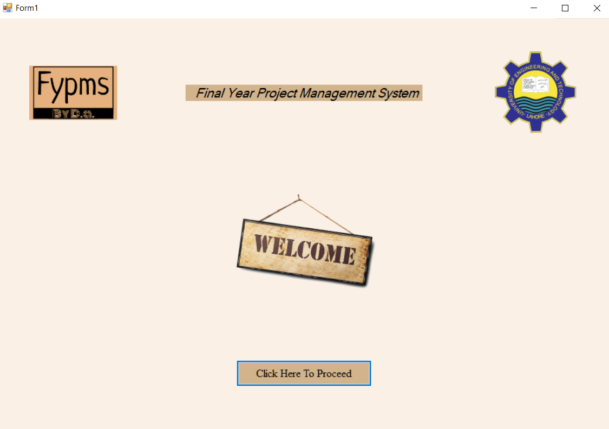
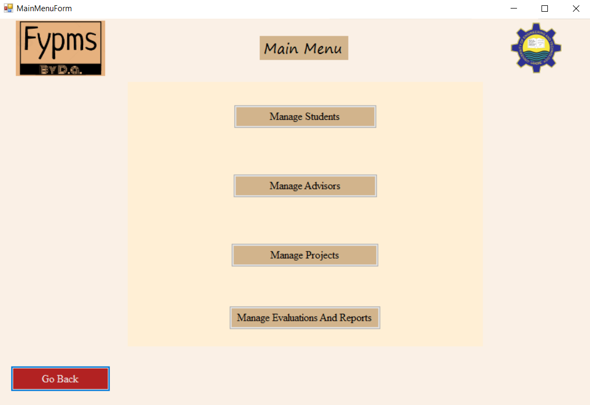

# Final Year Project Management System

This repository contains work originally developed in March-April 2023. The commits are dated according to the original work timeline, but the repository was created on 29th August, 2024 for organizational and archival purposes.

## Overview

This project is a **Final Year Project Management System** developed using Windows Forms, C#, and SQL Server Management Studio. It was created as part of the course **Database Systems**. The system is designed to streamline the management of student projects and related activities within an academic environment.

## Features

The application is managed by a single user, **admin**, who has complete authority over the system and can perform the following functions:

1. **Student Management**: Add, update, and maintain student information.
2. **Advisor Management**: Add and update details of advisors.
3. **Project Management**: Add, update, and view project details.
4. **Group Management**: Form student groups, with a maximum of four students per group.
5. **Project Assignment**: Assign projects to student groups.
6. **Evaluation Management**: Add, update, and mark evaluations.
7. **Report Generation**: Generate PDF reports containing useful information.

## Screenshots

### Landing Page

### Main Menu

